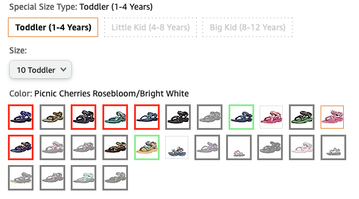

# Amazon Free Shipping Marker

This is a userscript that helps you identify items on Amazon that are eligible for free shipping to Israel. It works by adding a border around the product variant images. The border color indicates the shipping eligibility:

- Green border: The item is eligible for free shipping to Israel.
- Red border: The item is not eligible for free shipping to Israel.
- Grey border: The shipping information for the item could not be found.

## Installation

1. Install the [Tampermonkey](https://www.tampermonkey.net/) extension for Chrome or [Greasemonkey](https://addons.mozilla.org/en-US/firefox/addon/greasemonkey/) extension for Firefox.
2. Open [amazon-free-shipping-marker.user.js](https://raw.github.com/arbiv/amazon-free-shipping-marker/blob/main/amazon-free-shipping-marker.user.js).
3. The installation screen will open automatically. Click "Install" to add the script.

## Usage

Once the script is installed, it will automatically run whenever you visit a product page on Amazon. You don't need to do anything else.

## Compatibility

The script has been tested with the Greasemonkey extension on Firefox and the Tampermonkey extension on Chrome.

## License

This script is released under the MIT License.
